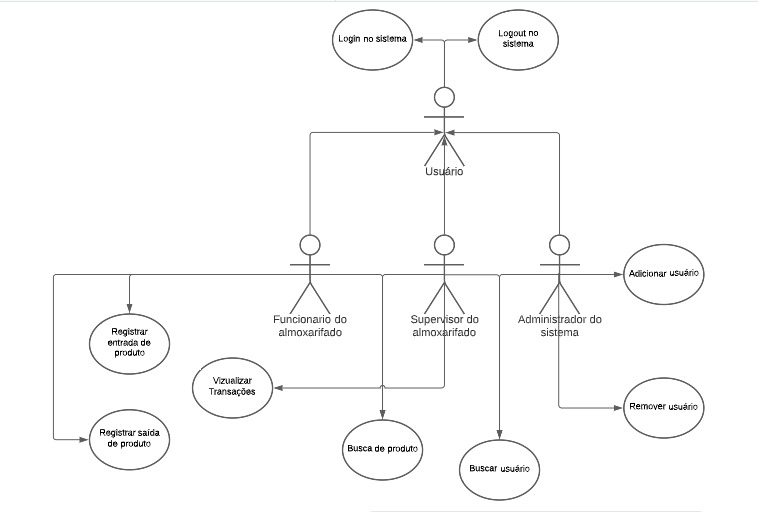

<h2 align="center"> GesTADS</h2>

<h5 align=center> Repositório para o projeto de gestão de almoxaridado GesTADS que será desenvolvido como trabalho final da disciplina de Padrões de Projeto do curso de Análise e Desenvolvimento de Sistemas do IFPE </h5>


* <h3>Arquitetura básica do projeto</h3>


* <h3>Diagrama de casos de uso</h3>


* <h3>Banco de dados</h3>
<h5 align=center>Esse projeto pode utilizar um banco de dados MySQL, dessa forma é necessário instalar o MySQL, criar o banco de dados e as tabelas antes de utilizar o sistema.</h5>


- 1:  Criar o banco de dados SQL: create database gesTADS;
	``` CREATE DATABASE gesTADS; ```
	
- 2: Criar o usuário do banco, você deve estar logado como root;
	``` CREATE USER 'gesTADSuser'@'localhost' IDENTIFIED BY 'gesTADSpassword'; ```
	
- 3: Dar o devido acesso ao usuário criado
	``` grant all privileges on gesTADS.* to 'gesTADSuser'@'localhost';```
	
- 4: Criar as dabelas abaixo;
	```create table employee (id int primary key, nome varchar (255), login varchar (255), senha varchar (255), cargo varchar (255), cpf varchar (100) not null unique);```
	
	```create table cargo (id int auto_increment primary key, nome varchar (255));```
	
	
	```create table produto (id int primary key, nome varchar (255), fabricante varchar (255), quantidade int); create table transaction (id int primary key, id_solicitante Long, id_produto Long, tipotransacao int, quantidade int);```
	
	
