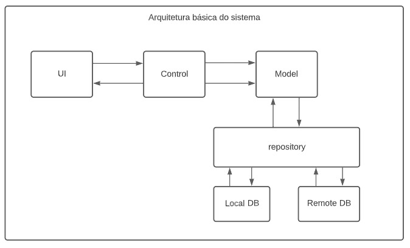

<h2 align="center"> GesTADS</h2>

<h5 align=center> Repositório para o projeto de gestão de almoxaridado GesTADS que será desenvolvido como trabalho final da disciplina de Padrões de Projeto do curso de Análise e Desenvolvimento de Sistemas do IFPE </h5>

* <h3>Arquitetura básica do projeto</h3>

* <h3>Estratégia de branching</h3>

